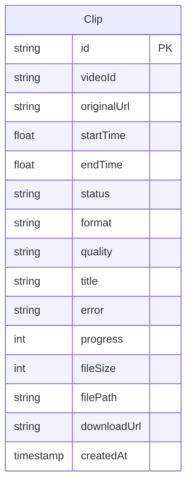
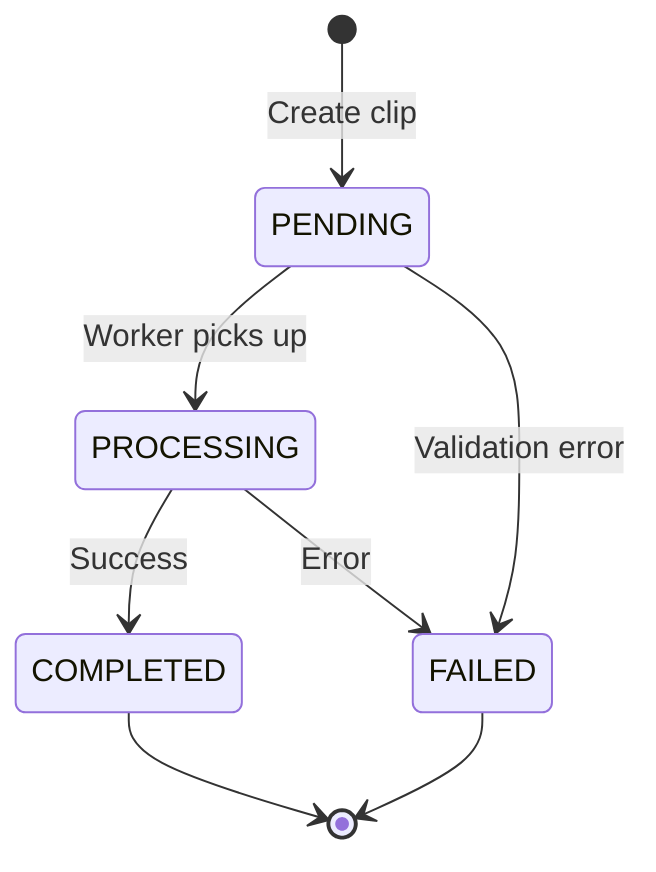

# Database Schema

Complete database schema documentation for Backend Clip Service.

## Overview

The application uses **PostgreSQL** with **SQLAlchemy ORM** for database operations.

## Tables

### Clip Table

Stores all clip job information and processing status.

#### Schema

```sql
CREATE TABLE "Clip" (
    id VARCHAR PRIMARY KEY DEFAULT uuid_generate_v4(),
    "videoId" VARCHAR NOT NULL,
    "originalUrl" VARCHAR NOT NULL,
    "startTime" DOUBLE PRECISION NOT NULL,
    "endTime" DOUBLE PRECISION NOT NULL,
    status VARCHAR NOT NULL DEFAULT 'PENDING',
    format VARCHAR NOT NULL DEFAULT 'mp4',
    quality VARCHAR,
    title VARCHAR,
    error VARCHAR,
    progress INTEGER NOT NULL DEFAULT 0,
    "fileSize" INTEGER,
    "filePath" VARCHAR,
    "downloadUrl" VARCHAR,
    "createdAt" TIMESTAMP WITH TIME ZONE DEFAULT CURRENT_TIMESTAMP
);
```

#### Columns

| Column | Type | Nullable | Default | Description |
|--------|------|----------|---------|-------------|
| `id` | VARCHAR (UUID) | NO | uuid_generate_v4() | Primary key, unique clip identifier |
| `videoId` | VARCHAR | NO | - | YouTube video ID |
| `originalUrl` | VARCHAR | NO | - | Full YouTube URL |
| `startTime` | FLOAT | NO | - | Start time in seconds |
| `endTime` | FLOAT | NO | - | End time in seconds |
| `status` | VARCHAR | NO | 'PENDING' | Processing status |
| `format` | VARCHAR | NO | 'mp4' | Output format (mp4, mp3, webm) |
| `quality` | VARCHAR | YES | NULL | Video quality (e.g., '720p') |
| `title` | VARCHAR | YES | NULL | Video title |
| `error` | VARCHAR | YES | NULL | Error message if failed |
| `progress` | INTEGER | NO | 0 | Processing progress (0-100) |
| `fileSize` | INTEGER | YES | NULL | File size in bytes |
| `filePath` | VARCHAR | YES | NULL | Server file path |
| `downloadUrl` | VARCHAR | YES | NULL | Public download URL |
| `createdAt` | TIMESTAMP | NO | NOW() | Creation timestamp |

#### Status Values

| Status | Description | Next States |
|--------|-------------|-------------|
| `PENDING` | Job queued, not started | PROCESSING, FAILED |
| `PROCESSING` | Currently downloading/processing | COMPLETED, FAILED |
| `COMPLETED` | Successfully completed | - |
| `FAILED` | Processing failed | - |

#### Indexes

```sql
-- Recommended indexes for performance
CREATE INDEX idx_clip_status ON "Clip"(status);
CREATE INDEX idx_clip_created ON "Clip"("createdAt" DESC);
CREATE INDEX idx_clip_videoid ON "Clip"("videoId");
```

#### Constraints

```sql
-- Add check constraints
ALTER TABLE "Clip" ADD CONSTRAINT check_time_range 
    CHECK ("endTime" > "startTime");

ALTER TABLE "Clip" ADD CONSTRAINT check_progress_range 
    CHECK (progress >= 0 AND progress <= 100);

ALTER TABLE "Clip" ADD CONSTRAINT check_status_values 
    CHECK (status IN ('PENDING', 'PROCESSING', 'COMPLETED', 'FAILED'));
```

---

## SQLAlchemy Model

```python
from sqlalchemy import Column, String, Float, Integer, DateTime
from sqlalchemy.sql import func
from app.database import Base
import uuid

class Clip(Base):
    __tablename__ = "Clip"
    
    id = Column(String, primary_key=True, default=lambda: str(uuid.uuid4()))
    videoId = Column(String, nullable=False)
    originalUrl = Column(String, nullable=False)
    startTime = Column(Float, nullable=False)
    endTime = Column(Float, nullable=False)
    status = Column(String, nullable=False, default="PENDING")
    format = Column(String, nullable=False, default="mp4")
    quality = Column(String, nullable=True)
    title = Column(String, nullable=True)
    error = Column(String, nullable=True)
    progress = Column(Integer, nullable=False, default=0)
    fileSize = Column(Integer, nullable=True)
    filePath = Column(String, nullable=True)
    downloadUrl = Column(String, nullable=True)
    createdAt = Column(DateTime(timezone=True), server_default=func.now())
```

---

## Entity Relationship Diagram



---

## Lifecycle



---

## Queries

### Common Queries

#### Get Clip by ID

```python
clip = db.query(Clip).filter(Clip.id == clip_id).first()
```

```sql
SELECT * FROM "Clip" WHERE id = 'uuid-here';
```

#### Get All Processing Clips

```python
clips = db.query(Clip).filter(Clip.status == 'PROCESSING').all()
```

```sql
SELECT * FROM "Clip" WHERE status = 'PROCESSING';
```

#### Get Recent Clips

```python
clips = db.query(Clip)\
    .order_by(Clip.createdAt.desc())\
    .limit(10)\
    .all()
```

```sql
SELECT * FROM "Clip" 
ORDER BY "createdAt" DESC 
LIMIT 10;
```

#### Get Clips by Video ID

```python
clips = db.query(Clip)\
    .filter(Clip.videoId == video_id)\
    .all()
```

```sql
SELECT * FROM "Clip" WHERE "videoId" = 'VIDEO_ID';
```

#### Get Failed Clips

```python
clips = db.query(Clip)\
    .filter(Clip.status == 'FAILED')\
    .order_by(Clip.createdAt.desc())\
    .all()
```

```sql
SELECT * FROM "Clip" 
WHERE status = 'FAILED' 
ORDER BY "createdAt" DESC;
```

---

## Migrations

### Using Alembic

#### Setup

```bash
# Install Alembic
pip install alembic

# Initialize
alembic init alembic
```

#### Configuration

```python
# alembic/env.py
from app.database import Base
from app.models import Clip

target_metadata = Base.metadata
```

#### Create Migration

```bash
# Auto-generate migration
alembic revision --autogenerate -m "Add clip table"

# Apply migration
alembic upgrade head

# Rollback
alembic downgrade -1
```

---

## Maintenance

### Cleanup Old Records

```sql
-- Delete completed clips older than 7 days
DELETE FROM "Clip" 
WHERE status = 'COMPLETED' 
AND "createdAt" < NOW() - INTERVAL '7 days';

-- Delete failed clips older than 30 days
DELETE FROM "Clip" 
WHERE status = 'FAILED' 
AND "createdAt" < NOW() - INTERVAL '30 days';
```

### Vacuum Database

```bash
# Analyze and optimize
docker exec clipscutter-postgres vacuumdb -U postgres -d clipsCutter -v

# Full vacuum (requires downtime)
docker exec clipscutter-postgres vacuumdb -U postgres -d clipsCutter --full
```

### Statistics

```sql
-- Clips by status
SELECT status, COUNT(*) 
FROM "Clip" 
GROUP BY status;

-- Average processing time (requires completion timestamp)
SELECT AVG(EXTRACT(EPOCH FROM ("completedAt" - "createdAt"))) as avg_seconds
FROM "Clip" 
WHERE status = 'COMPLETED';

-- Clips per day
SELECT DATE("createdAt"), COUNT(*) 
FROM "Clip" 
GROUP BY DATE("createdAt") 
ORDER BY DATE("createdAt") DESC;
```

---

## Backup & Restore

### Backup

```bash
# Full backup
pg_dump $DATABASE_URL > backup.sql

# Compressed backup
pg_dump $DATABASE_URL | gzip > backup.sql.gz

# Specific table
pg_dump $DATABASE_URL -t Clip > clip_backup.sql
```

### Restore

```bash
# Restore from backup
psql $DATABASE_URL < backup.sql

# Restore compressed
gunzip -c backup.sql.gz | psql $DATABASE_URL
```

---

## Performance Optimization

### Indexes

```sql
-- Status lookup
CREATE INDEX idx_clip_status ON "Clip"(status);

-- Recent clips
CREATE INDEX idx_clip_created ON "Clip"("createdAt" DESC);

-- Video lookup
CREATE INDEX idx_clip_videoid ON "Clip"("videoId");

-- Composite index for common query
CREATE INDEX idx_clip_status_created ON "Clip"(status, "createdAt" DESC);
```

### Query Optimization

```sql
-- Use EXPLAIN to analyze queries
EXPLAIN ANALYZE 
SELECT * FROM "Clip" 
WHERE status = 'PROCESSING';

-- Check index usage
SELECT schemaname, tablename, indexname, idx_scan
FROM pg_stat_user_indexes
WHERE tablename = 'Clip';
```

---

## Future Enhancements

Potential schema additions:

```sql
-- User table (for authentication)
CREATE TABLE "User" (
    id VARCHAR PRIMARY KEY,
    email VARCHAR UNIQUE NOT NULL,
    "createdAt" TIMESTAMP DEFAULT NOW()
);

-- Add user_id to Clip
ALTER TABLE "Clip" ADD COLUMN "userId" VARCHAR REFERENCES "User"(id);

-- Clip history/audit log
CREATE TABLE "ClipHistory" (
    id SERIAL PRIMARY KEY,
    "clipId" VARCHAR REFERENCES "Clip"(id),
    status VARCHAR NOT NULL,
    "changedAt" TIMESTAMP DEFAULT NOW()
);
```

---

## Related Documentation

- [Architecture Overview](overview.md)
- [Queue System](queue.md)
- [API Reference](../api/overview.md)
