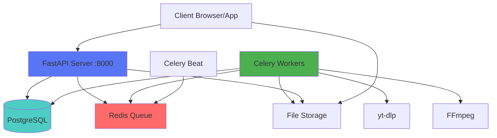
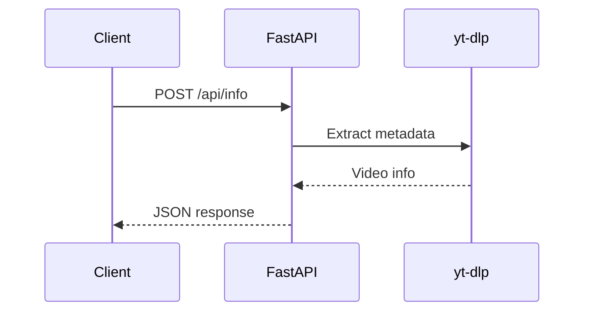
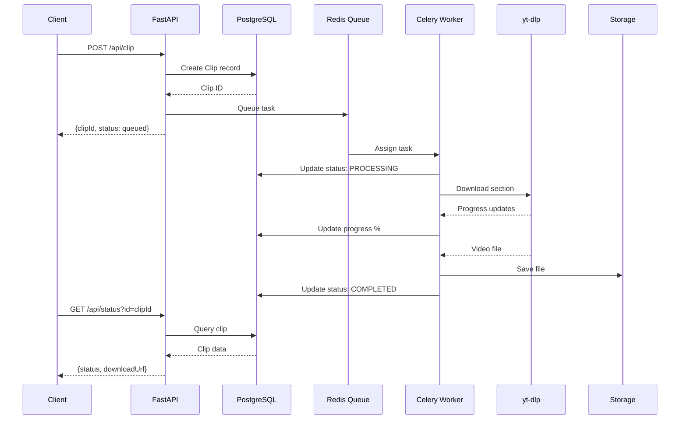

# System Architecture

## Overview

The Backend Clip Service uses a **microservices architecture** with asynchronous task processing for scalable video clipping operations.

## Architecture Diagram



## Components

### 1. FastAPI Server

**Purpose:** HTTP API server for handling client requests

**Responsibilities:**
- Receive and validate API requests
- Create database records
- Queue background jobs
- Serve static files (downloads)
- Provide API documentation

**Technology:** FastAPI + Uvicorn

**Scaling:** Horizontal (multiple instances behind load balancer)

---

### 2. PostgreSQL Database

**Purpose:** Persistent data storage

**Schema:**
- `Clip` table - Stores clip metadata and status

**Features:**
- ACID compliance
- Connection pooling
- Indexes on frequently queried fields

**Scaling:** Vertical + Read replicas

---

### 3. Redis

**Purpose:** Message broker and result backend

**Usage:**
- Celery task queue
- Task result storage
- Optional caching layer

**Scaling:** Redis Cluster or Sentinel

---

### 4. Celery Workers

**Purpose:** Background task processing

**Tasks:**
- Download video sections (yt-dlp)
- Process videos (FFmpeg)
- Update database with progress
- Cleanup old files

**Configuration:**
- Concurrency: 5 workers per instance
- Retry: 3 attempts with exponential backoff
- Timeout: 1 hour per task

**Scaling:** Horizontal (add more worker instances)

---

### 5. Celery Beat

**Purpose:** Scheduled task execution

**Tasks:**
- Hourly file cleanup
- Database maintenance (future)
- Health checks (future)

**Scaling:** Single instance (leader election for HA)

---

### 6. File Storage

**Purpose:** Temporary storage for processed clips

**Current:** Local filesystem (`./public/temp`)

**Production:** Object storage (S3, Spaces, R2)

**Cleanup:** Automatic deletion after 1 hour

---

## Request Flow

### Video Info Request



### Clip Creation Flow



## Data Flow

### Database Schema

```
Clip
├── id (UUID, PK)
├── videoId (String)
├── originalUrl (String)
├── startTime (Float)
├── endTime (Float)
├── status (String) - PENDING | PROCESSING | COMPLETED | FAILED
├── format (String) - mp4 | mp3 | webm
├── quality (String, nullable)
├── title (String, nullable)
├── error (String, nullable)
├── progress (Integer) - 0-100
├── fileSize (Integer, nullable)
├── filePath (String, nullable)
├── downloadUrl (String, nullable)
└── createdAt (DateTime)
```

[Database Schema Details →](database.md)

## Technology Stack

| Layer | Technology | Purpose |
|-------|-----------|---------|
| **API** | FastAPI 0.109 | Web framework |
| **Server** | Uvicorn | ASGI server |
| **Queue** | Celery 5.3 | Task queue |
| **Broker** | Redis | Message broker |
| **Database** | PostgreSQL 15 | Data persistence |
| **ORM** | SQLAlchemy 2.0 | Database abstraction |
| **Validation** | Pydantic 2.5 | Schema validation |
| **Video Download** | yt-dlp 2024 | YouTube downloader |
| **Video Processing** | FFmpeg | Video manipulation |
| **Container** | Docker | Deployment |

## Scalability

### Horizontal Scaling

**API Servers:**
```bash
docker-compose up -d --scale api=3
```

**Workers:**
```bash
docker-compose up -d --scale worker=10
```

### Vertical Scaling

- Increase worker concurrency
- Optimize database queries
- Add database indexes
- Use connection pooling

### Load Balancing

```
                    ┌──────────────┐
                    │ Load Balancer│
                    └──────┬───────┘
                           │
            ┌──────────────┼──────────────┐
            │              │              │
        ┌───▼───┐      ┌───▼───┐      ┌───▼───┐
        │ API 1 │      │ API 2 │      │ API 3 │
        └───────┘      └───────┘      └───────┘
```

## High Availability

### Database

- Primary-Replica setup
- Automatic failover
- Regular backups

### Redis

- Redis Sentinel for HA
- Redis Cluster for sharding

### Workers

- Multiple worker instances
- Automatic task retry
- Dead letter queue

## Security

### Current

- CORS configuration
- Input validation
- SQL injection prevention (ORM)

### Production Recommendations

- [ ] Add authentication (JWT)
- [ ] Implement rate limiting
- [ ] Use HTTPS/TLS
- [ ] Add API keys
- [ ] Enable request logging
- [ ] Implement RBAC
- [ ] Add WAF (Web Application Firewall)

## Monitoring

### Metrics to Track

- API response times
- Task queue length
- Worker utilization
- Database connections
- Error rates
- Disk usage

### Tools

- **Prometheus** - Metrics collection
- **Grafana** - Visualization
- **Sentry** - Error tracking
- **Flower** - Celery monitoring

[Monitoring Guide →](../guides/monitoring.md)

## Performance

### Bottlenecks

1. **Video Download** - Limited by YouTube throttling
2. **Disk I/O** - File write operations
3. **Database** - Frequent status updates

### Optimizations

- Cache video metadata in Redis
- Batch database updates
- Use SSD for temp storage
- Implement CDN for downloads
- Enable FFmpeg hardware acceleration

## Future Enhancements

- [ ] WebSocket support for real-time updates
- [ ] Multi-region deployment
- [ ] Video preview generation
- [ ] Batch clip creation
- [ ] User accounts and quotas
- [ ] Analytics dashboard
- [ ] API versioning
