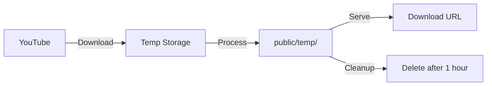

# Video Storage Guide

## 📁 Where Videos Are Saved

### Local Development

Videos are saved in:
```
Backend-Clip_Service/public/temp/
```

**Full Path:**
```
/home/user/Documents/Adyog/Projects/clipsCutter/Backend-Clip_Service/public/temp/
```

---

## 📂 File Structure

```
Backend-Clip_Service/
├── public/
│   └── temp/
│       ├── video_abc123.mp4      # Processed clips
│       ├── video_def456.mp3      # Audio clips
│       └── video_xyz789.webm     # WebM clips
```

---

## 🔄 Video Processing Flow



### Step-by-Step:

1. **Download** - Video downloaded from YouTube
2. **Process** - Trimmed to your time range
3. **Save** - Saved to `public/temp/`
4. **Serve** - Available at download URL
5. **Cleanup** - Automatically deleted after 1 hour

---

## 🌐 Access URLs

### Local Access

```
http://localhost:8000/temp/video_abc123.mp4
```

### Tailscale Access

```
http://100.70.7.54:8000/temp/video_abc123.mp4
```

### Example Response

When you create a clip, you get:

```json
{
  "id": "abc-123",
  "status": "COMPLETED",
  "downloadUrl": "/temp/video_abc123.mp4",
  "filePath": "/app/public/temp/video_abc123.mp4",
  "fileSize": 5242880
}
```

**Full Download URL:**
```
http://100.70.7.54:8000/temp/video_abc123.mp4
```

---

## 🐳 Docker vs Local

### Docker Mode

**Inside Container:**
```
/app/public/temp/
```

**On Your Machine (Volume Mount):**
```
/home/user/Documents/Adyog/Projects/clipsCutter/Backend-Clip_Service/public/temp/
```

**docker-compose.yml:**
```yaml
api:
  volumes:
    - ./public/temp:/app/public/temp  # Maps local to container
```

### Local Mode

**Direct Path:**
```
/home/user/Documents/Adyog/Projects/clipsCutter/Backend-Clip_Service/public/temp/
```

---

## 📊 Storage Configuration

### Environment Variable

```bash
# .env
TEMP_DIR=./public/temp
```

### Change Storage Location

```bash
# .env
TEMP_DIR=/path/to/your/storage
```

**Example:**
```bash
# Use external drive
TEMP_DIR=/mnt/external/clips

# Use home directory
TEMP_DIR=~/Videos/clips
```

---

## 🧹 Automatic Cleanup

### How It Works

Celery Beat runs a cleanup task **every hour**:

```python
# workers/celery_app.py
beat_schedule = {
    'cleanup-old-files': {
        'task': 'workers.tasks.cleanup_old_files',
        'schedule': crontab(minute=0),  # Every hour
    }
}
```

### Cleanup Rules

Files are deleted if:
- ✅ Older than 1 hour (configurable)
- ✅ Status is COMPLETED or FAILED

### Change Cleanup Time

```bash
# .env
MAX_FILE_AGE_HOURS=2  # Keep for 2 hours instead of 1
```

---

## 💾 Manual File Management

### View Files

```bash
# List all clips
ls -lh Backend-Clip_Service/public/temp/

# Count files
ls Backend-Clip_Service/public/temp/ | wc -l

# Check disk usage
du -sh Backend-Clip_Service/public/temp/
```

### Delete Old Files Manually

```bash
# Delete files older than 1 hour
find Backend-Clip_Service/public/temp/ -type f -mmin +60 -delete

# Delete all files
rm -rf Backend-Clip_Service/public/temp/*
```

### Backup Files

```bash
# Copy to backup location
cp -r Backend-Clip_Service/public/temp/ ~/backup/clips/

# Create archive
tar -czf clips-backup.tar.gz Backend-Clip_Service/public/temp/
```

---

## 🌍 Production Storage

### Current (Development)

```
Local filesystem: ./public/temp/
```

**Limitations:**
- ❌ Limited disk space
- ❌ Not scalable
- ❌ Lost on container restart (if not using volumes)

### Recommended (Production)

Use **Object Storage** instead:

#### AWS S3

```python
# app/config.py
aws_access_key_id: str = ""
aws_secret_access_key: str = ""
aws_s3_bucket: str = "clipscutter-files"
aws_region: str = "us-east-1"
```

#### DigitalOcean Spaces

```python
spaces_access_key: str = ""
spaces_secret_key: str = ""
spaces_bucket: str = "clipscutter"
spaces_region: str = "sgp1"
```

#### Cloudflare R2

```python
r2_access_key: str = ""
r2_secret_key: str = ""
r2_bucket: str = "clipscutter"
```

---

## 📈 Disk Space Management

### Check Available Space

```bash
# Check disk usage
df -h

# Check temp directory size
du -sh Backend-Clip_Service/public/temp/
```

### Monitor Space

```bash
# Watch disk usage in real-time
watch -n 5 'du -sh Backend-Clip_Service/public/temp/'
```

### Set Disk Quota (Optional)

```bash
# Limit temp directory to 10GB
# (requires filesystem quota support)
sudo setquota -u $USER 10G 10G 0 0 /
```

---

## 🔒 File Permissions

### Docker Mode

Files are created with container user permissions.

**Fix permissions if needed:**
```bash
sudo chown -R $USER:$USER Backend-Clip_Service/public/temp/
chmod -R 755 Backend-Clip_Service/public/temp/
```

### Local Mode

Files are created with your user permissions (normal).

---

## 📝 Database Records

### File Path in Database

```sql
SELECT id, "filePath", "downloadUrl", "fileSize" 
FROM "Clip" 
WHERE status = 'COMPLETED';
```

**Example:**
```
id: abc-123
filePath: /app/public/temp/video_abc123.mp4
downloadUrl: /temp/video_abc123.mp4
fileSize: 5242880 (bytes)
```

---

## 🎯 Quick Reference

| Question | Answer |
|----------|--------|
| Where are videos saved? | `Backend-Clip_Service/public/temp/` |
| How long are they kept? | 1 hour (configurable) |
| Can I change location? | Yes, set `TEMP_DIR` in `.env` |
| Are they backed up? | No, temporary storage only |
| Can I access via URL? | Yes, `http://100.70.7.54:8000/temp/filename.mp4` |
| What happens in Docker? | Volume mounted to same location |
| How to delete manually? | `rm Backend-Clip_Service/public/temp/*` |

---

## 🚀 Summary

**Videos save ஆகும் இடம்:**
```
Backend-Clip_Service/public/temp/
```

**Access URL:**
```
http://100.70.7.54:8000/temp/video_abc123.mp4
```

**Automatic cleanup:**
```
1 hour-க்கு அப்புறம் automatically delete ஆகும்
```

**Change location:**
```bash
# .env
TEMP_DIR=/your/custom/path
```

இப்ப உங்களுக்கு videos எங்க save ஆகும்னு தெரியும்! 📁
