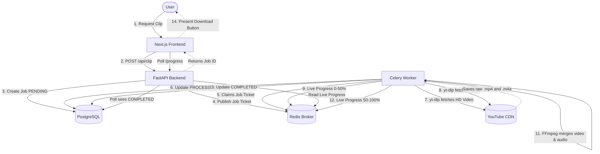
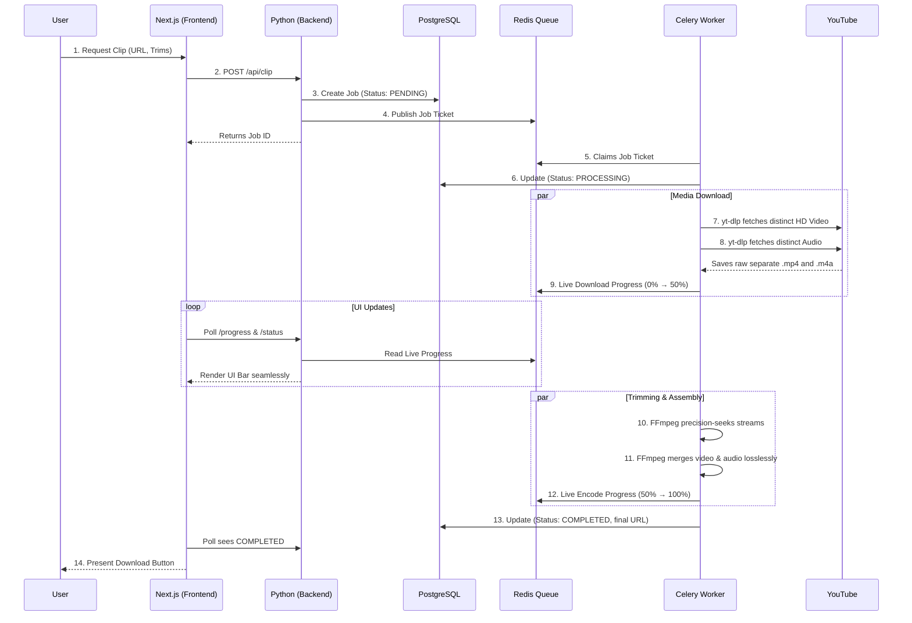

# ClipsCutter System Architecture & Workflow Guide

## High-Level System Overview

ClipsCutter is a distributed application that separates the user-interface (Next.js) from the heavy video-processing workloads (Python FastAPI + Celery). This separation ensures the web application never crashes or lags while handling large video processing tasks.

### Core Technology Stack:

1.  **Frontend:** Next.js (React), Tailwind CSS
2.  **Backend API:** Python FastAPI
3.  **Database:** PostgreSQL (managed via SQLAlchemy)
4.  **Message Broker:** Redis
5.  **Task Queue:** Celery Workers
6.  **Media Processing Engine:** `yt-dlp` & `FFmpeg`

---

## The Workflow Pipeline (End-to-End)

### Detailed Sequence Flow

When a user requests a video clip, the data flows exactly in this order:

1.  **UI Interaction:** User enters a YouTube URL in `src/app/page.tsx` and defines a start/end time in `src/components/VideoEditor.tsx`.
2.  **Proxy Forwarding:** The frontend POSTs the request to the Next.js API route (`src/app/api/clip/route.ts`), which acts as a secure middleman and forwards it to the Python backend.
3.  **Job Creation:** FastAPI (`Backend-Clip_Service/app/api/clip.py`) receives the request. It logs a new row in the PostgreSQL database with a status of `PENDING` and pushes the job parameters into the Redis message broker.
4.  **Worker Activation:** A Celery Worker (`workers/tasks.py`), constantly listening to Redis, spots the new ticket. It updates the database status to `PROCESSING` and begins execution.
5.  **Downloading:** The worker defers to `downloader.py`, executing `yt-dlp` to download the specific raw high-quality Video and Audio streams separately directly from YouTube's CDNs to avoid speed throttling.
6.  **Progress Tracking:** While downloading and formatting, the worker rapidly updates Redis with its current percentage. The frontend UI constantly polls the backend to read these Redis values for real-time progress bars.
7.  **Processing (FFmpeg):** `downloader.py` executes a heavily optimized `FFmpeg` bash command that takes the two raw audio/video files, seeks directly to the user's timestamps, and identically losslessly merges them into a final `.mp4` or `.mp3` file.
8.  **Job Completion:** The Celery Worker updates the PostgreSQL database to `COMPLETED`, attaches the final file download URL, and cleans up the temporary raw files.
9.  **Frontend Update:** The UI polling detects the `COMPLETED` flag, switches the progress bar to a green "DOWNLOAD" button, and the user receives their file.

---

## Detailed Directory & File Breakdown

### 1. Frontend: The Next.js Application

_Location: `src/`_

#### `src/app/page.tsx`

- **Role:** The main landing page.
- **Functions:** Handles the primary search bar where users paste YouTube URLs. It fetches initial video metadata (title, duration, thumbnail) via backend routes and stores it in `sessionStorage` before revealing the editor interface.

#### `src/components/VideoEditor.tsx`

- **Role:** The core interactive clipping interface.
- **Functions:**
  - **`handleClip()`:** The trigger function. Takes the user's `startTime`, `endTime`, `format`, and `quality` and POSTs them to the backend to begin processing. Starts the 3-second polling interval to fetch live `PROCESSING` progress percentages from the database.
  - **`fetchClips()`:** Queries the database for the status of the user's recent tasks, but fundamentally relies on the browser's `localStorage` to know _which_ clips this specific browser is actually tracking.
  - **`handleCancelProcessing()`:** Sends an interrupt signal (`/cancel`) to the backend if the user aborts an active job, and actively scrubs the job from the local UI state.

#### `src/app/clips/page.tsx`

- **Role:** The global history page for all generated clips.
- **Functions:** A consolidated view that reads from `localStorage` to render every previous processing success, failure, or active download. Sits on a cross-tab React listener to update live if a clip is requested or deleted in another browser tab.

#### `src/app/api/...` (Next.js Proxies)

- **Role:** The middleman translators.
- **Functions:** Because the React frontend shouldn't talk directly to a cross-origin Python server, Next.js sets up native API routes (`/api/clip`, `/api/clips/progress`, etc.) that ingest the client's request and cleanly `fetch()` the exact same parameters over to FastAPI.

---

### 2. Backend API: FastAPI + PostgreSQL

_Location: `Backend-Clip_Service/app/`_

#### `app/api/clip.py`

- **Role:** The ingestion point for new clipping tasks.
- **Functions:** Receives the Next.js target data, logs a pristine `Clip` record in PostgreSQL via SQLAlchemy with a `PENDING` tag, and explicitly kicks off the `process_clip_task.delay()` function, pushing the heavy payload into Redis for Celery to find.

#### `app/api/status.py`

- **Role:** The real-time status tracker.
- **Functions:**
  - **`get_clip_status()`:** Rapidly queries PostgreSQL to report if a job is `COMPLETED`, `FAILED`, or `PROCESSING`.
  - **`cancel_clip()`:** If a user aborts, this endpoint forcefully injects a kill-flag (`cancel_job:<clip_id> = "1"`) into Redis. The isolated Celery worker monitoring that specific clip will see the flag and immediately self-terminate its FFmpeg processes.

#### `app/models.py`

- **Role:** The Database Schema.
- **Functions:** Defines the strict `Clip` table layout (ID, VideoID, Status, StartTime, EndTime, Format, URL location, etc.) ensuring robust data persistence.

---

### 3. The Processing Engine: Celery + FFmpeg

_Location: `Backend-Clip_Service/`_

#### `workers/tasks.py`

- **Role:** The background worker brain.
- **Functions:**
  - **`process_clip_task()`:** Automatically triggered when Redis alerts it to a new job. It transitions the database to `PROCESSING`, boots up a small cancellation-monitor daemon thread (to watch for the Redis kill-flag mentioned above), and executes the `downloader.py` script. Acts as the massive try/catch block handling crashes or failures.

#### `services/downloader.py`

- **Role:** The raw media manipulator, executing bash shell processes.
- **Functions:**
  - **`yt_dlp_hook()`:** A real-time injection hook. As `yt-dlp` rapidly chunks the YouTube CDN data, this hook scales that download percentage from 0%→50% and pushes it live to Redis so the user sees a smoothly moving UI bar.
  - **FFmpeg Compilation:** Generates bash instructions: `ffmpeg -ss <start> -i video.mp4 -ss <start> -i audio.m4a -t <duration> -c:v copy -c:a copy output.mp4`. This explicitly avoids re-encoding video tracks wherever identically possible, guaranteeing mathematically perfect, instantaneous video assembly. It scales its progress from 50%→100% back to Redis.
